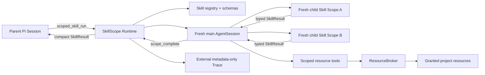

# SkillScope

SkillScope 是一个面向 [Pi coding agent](https://github.com/badlogic/pi-mono) 的研究型 runtime：把委托做成更加轻量、随用随销的 Subagent Scope；主 Skill 还能为每次子 Skill 调用再创建一个不继承历史的新 Scope；跨 Scope 只返回 Runtime 校验过的结构化结果。当前最重要的研究问题是：这种设计能否减少父会话上下文占用，同时保持或提高端到端任务稳定性。

当前版本是 **v0.1 research prototype**，不是进程沙箱，也不是生产级权限系统。已经实证通过的窄路径是：Pi `0.84.2`、单并发、可信 Extension、显式 API-key `openai-completions` provider、受控文本 fixture、exact-file `BOUNDED`。目录、`PROJECT`、通用 provider、恶意 Skill 隔离和生产容量治理都还没有放行。

## 现在有什么

- `scoped_skill_run` Pi Extension：创建独立 in-memory AgentSession，不继承父 messages、AGENTS、全局 Skills 或 Prompt templates。
- main Skill 可通过 `scope_invoke_skill` 启动 allowlist 中的独立 child Skill Scope；Runtime限制深度、数量、并发和向下授权，并记录父子ID、调用树usage与dispose账本。
- `SEALED / BOUNDED / PROJECT` 三种读取 Profile；PromptRefs 与后续探索授权分开。
- Runtime-owned `SkillResult`、严格状态矩阵、预算、timeout、evidence 引用和 `NEED_CONTEXT` 资源请求。
- fail-closed ResourceBroker：`read / list / search`，覆盖 traversal、symlink、前缀碰撞、Unicode/编码和 grant 外访问。
- 项目外 `metadata-only-v1` Trace：业务正文与路径只保存 hash、字节数和计数。
- 五条件 access-frontier 实验 Harness、反事实 fixtures、forced-undergrant 机制 probes 和 family-cluster 分析器。



## 快速验证

要求 Node.js 26；本仓库精确测试 Pi `0.84.2`。

```bash
npm ci
npm run typecheck
npm test
node scripts/security/run.mjs
```

从源码加载 Extension：

```bash
node_modules/.bin/pi \
  --extension ./src/pi/index.ts \
  --skill ./skills \
  --approve
```

这条命令只演示资源加载。实际 `scoped_skill_run` 还要求父 Pi 的 Registry 已把认证解析成可冻结的 API-key snapshot；它可以源于父 CLI 或标准 provider 环境变量，但 child 不会自行从 ambient auth 兜底。非 `openai-completions` transport、OAuth/native/custom stream 会 fail closed。仓库在线证据固定使用 `opencode-go/deepseek-v4-flash`，但插件本身没有硬编码 DeepSeek。

父 Agent 调用的最小形状如下。v0.1 推荐 exact-file grant：

```json
{
  "skill": "analyze-evidence",
  "input": {
    "question": "What caused the import failure?",
    "answerStyle": "concise"
  },
  "promptRefs": [
    {
      "kind": "inline",
      "name": "incident ticket",
      "content": "Diagnose only from granted evidence."
    }
  ],
  "resourceGrants": [
    {
      "path": "logs/import.log",
      "kind": "file",
      "operations": ["read", "search"]
    }
  ],
  "accessMode": "BOUNDED"
}
```

`NEED_CONTEXT` 只把 `requestedResources` 返回父级；当前插件不会自动批准、扩权、续跑或重跑。实验 Harness 中的 `BOUNDED_NEED_RESOURCE` 是另一套明确的“一次批准后 fresh rerun”研究协议。

## 已获得的证据

直接针对“父上下文＋结构化返回＋嵌套 Skill”的四条件 Harness 和本地实现已完成，但**尚无该新版 60-trial live 结果**，因此现在还不能声称 SkillScope 已经降低父上下文或提高稳定性。设计、指标与运行门见[父上下文与嵌套 SkillScope 实验](./experiments/parent-context/README.md)。以下访问实验只提供底层边界与 Harness 经验，不能替代这个根本目标的证据。

- 真实 `deepseek-v4-flash`：源码宿主完整 E2E 和一次“npm tarball → 全新安装 → 真实父 Pi → 已安装 Extension → 真实子 Session”历史手工链均为 `SUCCESS`。后者的自动重放脚本在 180 秒和 300 秒外层上限下都超时，尚不能称为稳定的一键复现入口。
- 新 Trace E2E 断言：授权 exact-file 是唯一物理物化/实际读取/模型可见资源；项目根枚举被拒绝；业务路径、诊断正文和 API key 未以明文进入外置 `metadata-only-v1` Trace。仓库中的审核版合成 E2E 摘要另行保留了非敏感 fixture 诊断，不能与 Trace 隐私边界混为一谈。
- 独立安全门禁覆盖 7,168 条 hostile paths、1,024 个前缀碰撞及确定性 broker/Pi/Trace 攻击用例。
- 第一轮 70-job access-frontier dry pilot 提前证伪了隐藏 exact code/facts 评分设计；该批被明确降级为 measurement failure，没有被包装成 SkillScope 能力结论。新版公开 response contract 与 provenance 行映射由此产生。
- 从 clean commit `ddfd342` 运行的 Schema 2 探索性 Pilot 已完成 70 个 `deepseek-v4-flash` jobs：Project/Oracle Hard Pass 均为 14/14，Inferred/Need 均为 13/14，SEALED 为 1/14 且另有 13 次规范 abstention；70/70 Policy Pass，受限 Canary 可见 0/56，exfiltration 0/70。两个失败都是 high-entropy 任务在 planner fallback-all 后，第 25 次调用尝试触发冻结的 24-call 预算终止。
- 自然 Need 条件 0/14 发出资源请求，所以动态恢复效果是 `NOT_IDENTIFIABLE`，不是 0%。独立 forced-undergrant 的两个构造机会中，两个 control 均失败/abstain，两个 treatment 均 request、获批、fresh rerun 并恢复；这只证明条件化机制链可行，不能冒充自然 workload 收益。
- 后续 high-search-entropy Pilot 完成 50 个 jobs：exact-file Oracle 10/10、单一受控父目录 search handle 9/10、16个分片目录在24-call下0/10、提高到40-call后7/10、当前模型planner为0/10。Root与分片授权/读取文件面相同，差异来自跨集合导航；这支持把“底层授权集合”与“聚合搜索句柄”拆开，而不是直接扩大为PROJECT。随后的60-trial planner probe显示：root catalog在512 tokens已10/10合法，16-shard则从512的0/10升到2048的9/10，但所有合法sharded plan都全选16/16；预算修复协议完成，不产生选择性。
- 新的仓库内 ResourceSet snapshot Pilot 完成 48 个 jobs：Oracle/平铺24个exact files/相同exact files加聚合search handle/根目录句柄的 Hard Pass 为 9/12、3/12、8/12、6/12。ResourceSet 相对相同授权集合的 Exact 提高 `+0.42`，平均少6.42次调用和20,530 tokens；相对Root准确率高 `+0.17`，但平均多3.42次调用、43,991 tokens和11.72秒，尚未形成成本支配。Policy为48/48，Canary visible/exfiltration为0/48；一题facts设计有歧义，剔除后方向不变。

现有证据新增了一个真实代码仓库的内部 snapshot，但问题仍由同一研究者编写，只有一个仓库、六个任务、两个 repeat 和一个模型；它不是独立 repository/template holdout，也缺少普通 Subagent、Prompt-only/Resource-only 与 confirmatory margin/power。结果支持继续设计 experimental ResourceSet，仍不能给访问 Profile 作正式排名或直接发布生产架构。

详细证据见 [Schema 2 Pilot 人工复核](./experiments/access-frontier/reports/schema2-pilot-v1/README.md)、[高搜索熵 Pilot 人工复核](./experiments/access-frontier/reports/entropy-frontier-v1/README.md)、[Planner预算probe人工复核](./experiments/access-frontier/reports/planner-budget-v1/README.md)、[ResourceSet snapshot人工复核](./experiments/access-frontier/reports/resource-set-holdout-v1/README.md)、[实验日志](./docs/research/实验日志.md)、[插件实现独立审计](./docs/research/插件实现独立审计.md) 和 [R1 dry-pilot 报告](./experiments/access-frontier/reports/dry-r1/README.md)。

## 安全与解释边界

- 这是模型可见资源的进程内治理，不隔离 Extension/Skill JavaScript 的 OS 权限。威胁模型包含恶意第三方代码时，需要 child process/container。
- `PROJECT` 会向子模型授权可信项目中的文本；默认只跳过 `.git`、`.pi`、`node_modules`，不会自动排除 `.env`、配置或源码内凭据。优先使用 `BOUNDED`。
- realpath 检查不能消除所有 TOCTOU、hardlink、mount alias 风险；v0.1 不支持写操作。
- metadata-only Trace 使用无盐 SHA-256；低熵路径/状态可能被字典枚举，而且当前没有内置加密、retention 或 rotation。Trace 目录仍应按敏感数据保护。
- 证据门禁验证资源可见性和 ID 引用完整性，不等同于通用 claim-level 事实验证。
- 每个 main Scope 已有 child 数量与并发上限，但还没有跨父会话的进程级全局容量池；生产部署前仍需补全局容量与取消治理。
- `peerDependencies` 已固定为 Pi `0.84.2` 与 TypeBox `1.3.7`；本项目没有对其他宿主版本给出兼容证据。

## 研究入口

- [研究索引](./docs/research/README.md)
- [Pi 0.84.2 API Spike](./docs/research/Pi_0.84.2_API_Spike.md)
- [Zen / DeepSeek API 探测](./docs/research/Zen_API_探测.md)
- [安全不变量验证](./docs/research/安全不变量验证.md)
- [access-frontier Harness](./experiments/access-frontier/README.md)
- [父上下文与嵌套 SkillScope 实验](./experiments/parent-context/README.md)
- [Pi E2E 复现](./experiments/pi-e2e/README.md)

原始 live manifests/results 默认被 Git 忽略，因为它们含隐藏真值和未审阅模型输出；仓库只提交审核后的聚合报告、hash 和脱敏 E2E 摘要。

## License

MIT
