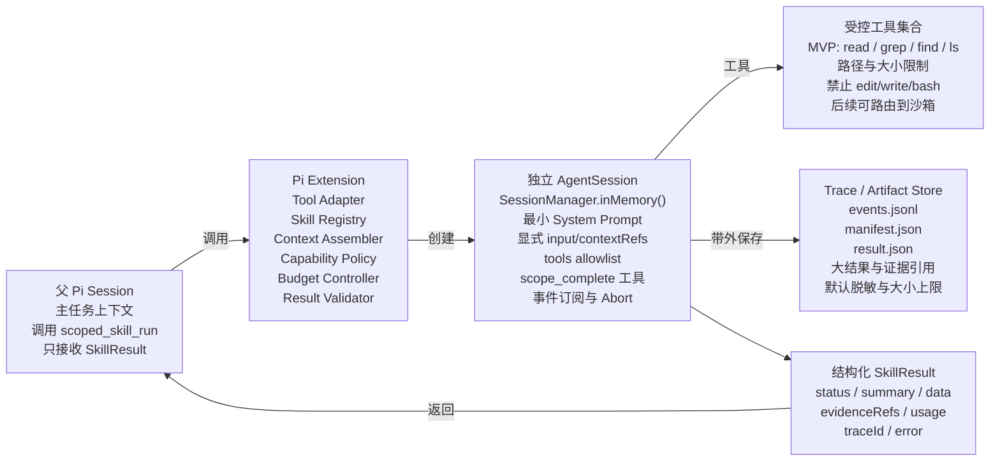

# pi-scoped-skills 开发设计

_基于 Pi Extension + SDK AgentSession 的 Scoped Skill Runtime_

> 以最小实现验证核心语义：父 Agent 通过一个工具调用明确 Skill；Runtime 创建独立 AgentSession，只注入显式上下文，只开放声明工具，最终仅返回结构化 SkillResult。

| 字段 | 值 |
| --- | --- |
| 项目 | pi-scoped-skills |
| 文档版本 | 0.1 |
| 基线环境 | Pi 0.84.2（锁定精确版本） |
| 日期 / 状态 | 2026-08-17 / Proposed / MVP Design |

_内部设计稿 · 可用于开源前评审与复现实验预注册_

## 阅读导航

本文档不依赖自动目录字段，以下导航按“问题 → 方法 → 证据 → 决策”组织。

| 章节 | 内容 |
| --- | --- |
| 0 | 架构结论与关键边界 |
| 1 | 目标、非目标与设计原则 |
| 2 | Pi 能力映射与技术选型 |
| 3 | 逻辑架构与完整执行时序 |
| 4 | 协议与核心数据结构 |
| 5 | 上下文、工具、预算与结果治理 |
| 6 | 存储、可观测、错误与安全 |
| 7 | 代码结构、接口骨架与开发计划 |
| 8 | 测试、发布与演进路线 |
| 附录 | 配置样例、代码示意与参考资料 |

## 0. 架构结论与关键边界

> **MVP 架构**
>
> 做成一个 Pi Package。Extension 向父 Agent 注册 scoped_skill_run 工具；工具内部使用 Pi SDK 创建独立、内存态 AgentSession，按 SkillSpec 构建最小 Prompt 和工具 allowlist，订阅事件执行预算治理，再通过 scope_complete 终止工具获得结构化结果。

| 决策 | 选择 | 理由 |
| --- | --- | --- |
| 宿主 | Pi 0.84.2 | Extension、SDK、AgentSession、工具事件和 Pi Package 已覆盖 MVP 所需扩展点 |
| MVP 执行后端 | InProcessSessionBackend | 最少代码、直接事件订阅、易于测量；用于逻辑隔离与实验 |
| 强隔离后端 | Process/ContainerBackend（后续） | Pi 无内建沙箱；进程/容器边界才是安全边界 |
| 对外工具面 | 仅 scoped_skill_run | 降低父模型选择成本；调试能力通过 Slash Command 给人使用 |
| 首版权限 | 只读：read/grep/find/ls | 先证明上下文与契约，不混入写操作、回滚和并发冲突 |
| 调用深度 | maxDepth = 1 | 递归不是验证核心价值的必要条件，先砍掉 |
| 结果通道 | SkillResult + Trace/Artifact 引用 | 父级只看决策所需信息，原始轨迹带外保存 |

> **边界声明**
>
> 工具 allowlist 与独立 AgentSession 提供的是“模型可见能力与上下文隔离”。Extension 和内置工具仍运行在启动 Pi 的用户权限下，因此不能宣传为主机级安全沙箱。需要强安全时，切换到子进程、Docker、Gondolin 或 OpenShell 后端。（参考 R3、R4）

## 1. 目标、非目标与设计原则

### 1.1 目标

- 父 Agent 可以按名称调用职责窄、输入输出明确的 Scoped Skill。

- 每次调用创建独立 AgentSession，不复制父 Session 消息历史。

- 子 Scope 只接收 input、显式 contextRefs 和固定系统约束。

- 子 Scope 只看到 SkillSpec 声明的工具，Runtime 记录并阻断越权。

- 子 Scope 通过结构化终止工具返回 SkillResult；自由文本不是正式结果。

- 完整事件、工具原始结果和大文件写入 Trace/Artifact Store，不进入父上下文。

- 支持 timeout、maxTurns、maxToolCalls、取消传播和 usage 统计。

- 以 Pi Package 形式通过 npm/git 安装，并附可复现实验。

### 1.2 非目标

- MVP 不实现多层递归、并行子 Skill、长期运行任务和分布式调度。

- MVP 不实现数据库/文件写入、自动提交、回滚与两阶段事务。

- MVP 不替代 Pi 原生 Skill 标准；它提供“如何执行 Skill”的 Runtime。

- MVP 不承诺防止恶意 Extension、主机进程或用户权限范围内的任意代码。

- MVP 不做可视化管理后台；Trace 先落本地 JSONL。

### 1.3 设计原则

| 原则 | 落地规则 |
| --- | --- |
| 显式优于隐式 | 跨 Scope 只传参数和引用，不自动继承父历史 |
| 能力只减不增 | effectiveTools = globalPolicy ∩ SkillSpec.allowedTools ∩ runtimeSupport |
| 结果小于过程 | 父级只接收摘要、数据、证据引用和 usage |
| 失败可定位 | 每次调用都有 scopeId、状态、事件流和终止原因 |
| 先读后写 | 第一版只读；有证据后再引入副作用 |
| 可证伪 | 任何架构能力都对应实验指标与失败门槛 |

## 2. Pi 能力映射与技术选型

### 2.1 Pi 能力映射

| 需求 | Pi 能力 | 实现方式 |
| --- | --- | --- |
| 父 Agent 调用插件 | Extension registerTool | 注册 scoped_skill_run，参数由 TypeBox 定义 |
| 独立上下文 | SDK createAgentSession + SessionManager.inMemory | 每次调用新建 Session，不传父 messages |
| 最小系统提示 | DefaultResourceLoader.systemPromptOverride | 只编译 Skill 目标、契约、输入与上下文 |
| 工具 allowlist | createAgentSession({ tools }) | 只启用 SkillSpec.allowedTools 与 scope_complete |
| 自定义结构化返回 | defineTool / customTools；tool result terminate | scope_complete 参数即输出 Schema，成功后结束 run |
| 可观测 | session.subscribe events | 记录 message/tool/agent 生命周期、usage 与错误 |
| 预算取消 | AgentSession.abort / dispose + AbortSignal | 事件计数或 timeout 达标时中止 |
| 父级上下文测量 | Extension ctx.getContextUsage() | 记录调用前后父 Session Token |
| 开源安装 | Pi Packages | package.json 的 pi.extensions / pi.skills |

Pi 官方 SDK 明确支持创建自定义工具来启动 sub-agent，并支持程序化测试 Agent 行为；Extension 也能拦截工具调用与修改结果。这使项目可以保持在公开扩展面上，而无需修改 Pi 内核。（参考 R1、R2）

### 2.2 后端选择

| 后端 | 优点 | 局限 | 用途 |
| --- | --- | --- | --- |
| InProcessSessionBackend | 直接调用 SDK、低启动开销、事件与状态可直接访问 | 同一 Node 进程与用户权限；不是安全沙箱 | MVP 与主实验 |
| ChildProcessBackend | 进程隔离、可复用 Pi JSON/RPC 模式、崩溃边界更清晰 | 启动成本高，模型/凭据/资源传递更复杂 | 强健性实验与 v0.2 |
| ContainerBackend | 文件系统、网络与进程权限可真正限制 | 部署重、跨平台复杂、凭据路由需设计 | 高风险写操作与安全版 |

> **M0 必做 Spike**
>
> 在正式开发前验证：Extension execute 内嵌 createAgentSession() 是否能稳定复用当前模型配置、认证、取消信号与事件订阅。若当前版本存在不可解决的嵌套运行问题，MVP 直接切换 ChildProcessBackend，不改变上层协议。

## 3. 逻辑架构与完整执行时序



> 边界声明：in-process AgentSession 提供上下文与工具可见性隔离，不构成 OS 安全沙箱；强隔离需要 process/container backend。

### 3.1 组件职责

| 组件 | 单一职责 | 明确不负责 |
| --- | --- | --- |
| Extension Adapter | 注册 scoped_skill_run 与调试命令；把 Pi Context 映射为 Invocation | 不拼接子 Prompt，不直接执行工具 |
| SkillRegistry | 发现、解析、缓存和版本化 SkillSpec | 不执行 Skill |
| ContextAssembler | 解析 contextRefs、裁剪、去重、计量 Token | 不访问未授权父消息 |
| CapabilityPolicy | 计算 effectiveTools，校验路径/副作用政策 | 不靠 Prompt 约束权限 |
| ChildSessionFactory | 创建独立 AgentSession 与最小 ResourceLoader | 不复用父 messages |
| BudgetController | 统计 turns/toolCalls/time/usage，触发 Abort | 不自动无限重试 |
| ResultValidator | 接收 scope_complete 结果，执行 Schema 校验与大小限制 | 不把自由文本当成功结果 |
| TraceStore | 保存事件、manifest、原始结果与脱敏日志 | 不自动注入父上下文 |
| ArtifactStore | 保存大文件与证据片段，返回稳定引用 | 不承担长期记忆 |

### 3.2 完整时序

1. 父模型调用 scoped_skill_run(skill, input, contextRefs, budgetOverride?)。

2. Extension Adapter 生成 invocationId，读取调用前父上下文 Token，并把请求交给 ScopeRuntime。

3. Registry 解析 SkillSpec；InputValidator 校验 input；Policy 计算 effectiveTools。

4. ContextAssembler 只解析显式 contextRefs，应用路径、行数、字节和 Token 上限。

5. ChildSessionFactory 创建 SessionManager.inMemory()、最小 ResourceLoader、scope_complete 工具与允许工具。

6. 子 Session 执行；TraceCollector 订阅 message_update、tool_execution_start/end、agent_end 等事件。

7. BudgetController 根据 turn、toolCall、timeout 或父 signal 触发 session.abort()。

8. 模型调用 scope_complete；ResultValidator 校验 Schema、状态、证据引用和最大返回大小。

9. 完整 Trace/Artifact 带外落盘；父工具结果 content 仅返回紧凑摘要，details 保存结构化 SkillResult。

10. 调用 session.dispose()；记录父上下文调用后 Token、最终 usage 与终止原因。
### 3.3 失败时序

| 失败点 | 状态 | 父级收到的最小信息 | 是否可重试 |
| --- | --- | --- | --- |
| 输入不合法 | INVALID_INPUT | 字段错误与 Schema path | 修正输入后可重试 |
| 上下文缺失 | NEED_CONTEXT | requestedContext 列表与原因 | 补充引用后重试 |
| 权限拒绝 | BLOCKED | tool/path/policy 与 traceId | 需改变策略，默认不自动重试 |
| 预算耗尽 | TIMEOUT / BUDGET_EXCEEDED | 已消耗 usage、最后进度与 traceId | 父级决定是否提高预算 |
| 模型/工具异常 | FAILED | errorCode、retryable、traceId | 仅按固定策略有限重试 |
| 结果不合法 | INVALID_RESULT | Schema errors、原始结果 artifactRef | 允许 1 次格式修复 |
| 父级取消 | CANCELLED | 取消原因与 usage | 不重试 |

## 4. 协议与核心数据结构

### 4.1 SkillSpec

**TypeScript 核心接口**

```typescript
export interface SkillSpec {
  name: string;
  version: string;
  description: string;
  promptFile: string;
  inputSchema: TSchema;
  outputSchema: TSchema;

  allowedTools: string[];
  allowedContextSchemes: Array<"inline" | "file" | "artifact">;
  sideEffectMode: "READ_ONLY"; // MVP

  budget: {
    maxTurns: number;
    maxToolCalls: number;
    timeoutMs: number;
    maxContextTokens: number;
    maxResultBytes: number;
  };

  modelPolicy?: {
    inheritParentModel: boolean;
    thinkingLevel?: ThinkingLevel;
  };
}
```

### 4.2 SkillInvocation 与 ExecutionScope

```typescript
export interface SkillInvocation<TInput = unknown> {
  invocationId: string;
  parentSessionId: string;
  skill: { name: string; version?: string };
  input: TInput;
  contextRefs: ContextRef[];
  budgetOverride?: Partial<SkillBudget>;
}

export interface ExecutionScope {
  scopeId: string;
  parentSessionId: string;
  cwd: string;
  spec: SkillSpec;
  effectiveTools: string[];
  contextSnapshot: ContextSnapshot;
  budget: SkillBudget;
  startedAt: string;
}
```

### 4.3 SkillResult

```typescript
export type SkillStatus =
  | "SUCCESS" | "PARTIAL" | "NEED_CONTEXT"
  | "BLOCKED" | "FAILED" | "TIMEOUT"
  | "BUDGET_EXCEEDED" | "CANCELLED" | "INVALID_RESULT";

export interface SkillResult<TData = unknown> {
  schemaVersion: "1.0";
  scopeId: string;
  skill: { name: string; version: string };
  status: SkillStatus;
  summary: string;
  data?: TData;
  evidenceRefs: EvidenceRef[];
  artifactRefs: ArtifactRef[];
  requestedContext?: ContextRequest[];
  warnings: string[];
  error?: { code: string; message: string; retryable: boolean };
  usage: ScopeUsage;
  traceId: string;
}
```

### 4.4 ContextRef

| Scheme | MVP 格式 | 规则 |
| --- | --- | --- |
| inline | inline://&lt;logical-name&gt; | 内容通过请求单独字段传入；限制总字节与 Token |
| file | file://relative/path#L10-L80 | 仅允许 cwd 内相对路径；强制行范围；拒绝符号链接逃逸 |
| artifact | artifact://&lt;artifact-id&gt; | 只读；必须属于当前父任务或显式共享集合 |

> **不支持的行为**
>
> MVP 不接受“把父会话都给子 Skill”“自行搜索所有历史”“自动注入全部 AGENTS.md/CLAUDE.md”。ResourceLoader 必须清空默认 Context Files、Skills、Prompts 和非必要 Extensions，只保留项目指定最小系统约束。

## 5. 上下文、工具、预算与结果治理

### 5.1 ContextAssembler

- 输入由四部分构成：固定系统规则、Skill prompt、已验证 input、已解析 contextRefs。

- 每个 ContextRef 先做路径规范化、范围校验、字节截断，再做 Token 估算。

- 相同文件片段按哈希去重；超限时不做静默截断，而返回明确 warning 或 NEED_CONTEXT。

- 父 Session 的消息数组、父 Agent 计划和其他 SkillResult 不自动复制。

- 上下文快照写入 manifest，只保存哈希与引用；敏感正文按配置脱敏。

**Prompt 组装原则**

```typescript
childPrompt = [
  scopedSystemRules,
  compileSkillPrompt(spec),
  JSON.stringify({ input: invocation.input }),
  renderContextSnapshot(contextSnapshot),
  "完成后必须调用 scope_complete；不要在普通文本中宣告成功。"
].join("\n\n");
```

### 5.2 CapabilityPolicy

**MVP 权限计算**

```typescript
effectiveTools = intersection(
  runtimeConfig.supportedTools,
  globalPolicy.allowedTools,
  skillSpec.allowedTools
);

assert(effectiveTools.includes("scope_complete"));
assert(!effectiveTools.includes("write"));
assert(!effectiveTools.includes("edit"));
assert(!effectiveTools.includes("bash")); // MVP 默认
```

第一道约束是在 createAgentSession({ tools }) 中只暴露允许工具；第二道约束是在自定义工具包装器/Extension tool_call 事件中再次校验调用、路径和参数。前者减少模型可见动作，后者防止配置错误或未来扩展产生旁路。

| 工具 | MVP | 额外限制 |
| --- | --- | --- |
| read | 允许 | cwd 内；最大文件与单次行数；拒绝敏感路径 |
| grep | 允许 | cwd 内；结果数量和字节上限 |
| find | 允许 | cwd 内；目录深度和数量上限 |
| ls | 允许 | cwd 内；条目数上限 |
| bash | 禁止 | 后续仅通过沙箱 operations backend 开放 |
| edit/write | 禁止 | 后续引入 ChangeSet + Commit 两阶段模型 |

### 5.3 BudgetController

| 预算 | 计数方式 | 触发动作 |
| --- | --- | --- |
| timeoutMs | 单调时钟 + AbortController | session.abort()，等待短暂 grace，再 dispose |
| maxTurns | message/turn 生命周期事件计数 | 标记 BUDGET_EXCEEDED 并中止 |
| maxToolCalls | tool_execution_start 计数 | 在下一次调用前阻断并中止 |
| maxContextTokens | ContextAssembler 估算 | 创建 Session 前拒绝或返回 NEED_CONTEXT |
| maxResultBytes | scope_complete 参数序列化大小 | 拒绝结果，要求改为 Artifact 引用 |
| root usage | 聚合子 Session usage | MVP 仅记录；递归版用于根预算 |

### 5.4 结构化终止

子 Session 必须携带一个自定义工具 scope_complete。其参数 Schema 由 SkillResult 外壳和当前 Skill outputSchema 组合而成；execute 返回 terminate: true。Pi 官方 Extension API 支持终止型工具结果，适合把“结果提交”从自然语言变为一次可校验动作。（参考 R1）

**示意代码；以 Pi 0.84.2 类型定义为准**

```typescript
const scopeComplete = defineTool({
  name: "scope_complete",
  label: "Complete scoped skill",
  description: "Submit the final structured SkillResult. Call exactly once.",
  parameters: buildCompletionSchema(spec.outputSchema),
  async execute(_id, params) {
    completionDeferred.resolve(params);
    return {
      content: [{ type: "text", text: "Scoped skill completed." }],
      details: params,
      terminate: true
    };
  }
});
```

若 Agent 正常结束但未调用 scope_complete，状态为 INVALID_RESULT。允许一次“只修格式”的补救调用，不重跑工具轨迹；补救仍失败则把原始最终文本保存为 Artifact，父级只收到错误与引用。

## 6. 存储、可观测、错误与安全

### 6.1 本地存储布局

```text
.pi/scoped-skills/
├── config.json
├── runs/
│   └── <scopeId>/
│       ├── manifest.json
│       ├── events.jsonl
│       ├── result.json
│       ├── stderr.log
│       └── artifacts/
└── cache/
    └── skill-specs.json
```

| 文件 | 内容 | 是否返回父上下文 |
| --- | --- | --- |
| manifest.json | 版本、模型、SkillSpec 哈希、预算、状态、usage | 仅 scopeId/usage 摘要 |
| events.jsonl | message/tool/agent 生命周期事件 | 否 |
| result.json | 完整 SkillResult | 返回裁剪后的结构化副本 |
| artifacts/* | 大工具结果、证据、日志片段 | 仅 ArtifactRef |
| stderr.log | 运行时诊断 | 仅错误引用 |

### 6.2 Trace 事件模型

```typescript
type ScopeTraceEvent =
  | { type: "scope_started"; ts: number; scopeId: string }
  | { type: "message_update"; ts: number; deltaBytes: number }
  | { type: "tool_start"; ts: number; name: string; callId: string }
  | { type: "tool_end"; ts: number; name: string; isError: boolean; bytes: number }
  | { type: "budget_update"; ts: number; turns: number; toolCalls: number }
  | { type: "completion_submitted"; ts: number; valid: boolean }
  | { type: "scope_finished"; ts: number; status: SkillStatus; usage: ScopeUsage };
```

### 6.3 脱敏与保留

- 默认不记录模型认证信息、环境变量值和完整请求头。

- 对疑似 API Key、Bearer Token、Cookie、私钥块做正则与熵检测脱敏。

- 事件内容默认记录元数据与哈希；开启 debug 才保存完整模型文本。

- Artifact 设总容量、单文件上限和 TTL；用户可执行 /scope-gc 清理。

- 开源 Benchmark 数据必须来自可公开 fixture，禁止上传真实私有仓库内容。

### 6.4 安全模型

| 层级 | 提供的保证 | 不提供的保证 |
| --- | --- | --- |
| AgentSession | 消息历史独立、工具集合独立、生命周期独立 | 进程/文件系统/网络隔离 |
| CapabilityPolicy | 未授权工具不向模型暴露，并在 Gateway 拒绝 | 恶意 Extension 或宿主代码隔离 |
| Path Policy | 限制内置只读工具访问 cwd 与允许路径 | 操作系统级 mount namespace |
| Process Backend | 崩溃与内存边界更清晰，可裁剪环境变量 | 默认仍继承用户文件权限 |
| Container/Sandbox | 文件、网络、进程与凭据可真正分区 | 业务逻辑正确性 |

## 7. 代码结构、接口骨架与开发计划

### 7.1 仓库结构

```text
pi-scoped-skills/
├── package.json
├── tsconfig.json
├── src/
│   ├── index.ts                     # Pi Extension 入口
│   ├── tools/scoped-skill-run.ts    # 父级工具
│   ├── runtime/scope-runtime.ts
│   ├── runtime/skill-registry.ts
│   ├── runtime/context-assembler.ts
│   ├── runtime/capability-policy.ts
│   ├── runtime/budget-controller.ts
│   ├── runtime/result-validator.ts
│   ├── pi/child-session-factory.ts
│   ├── pi/scope-complete-tool.ts
│   ├── backend/in-process.ts
│   ├── backend/child-process.ts      # v0.2
│   ├── storage/trace-store.ts
│   ├── storage/artifact-store.ts
│   └── types/*.ts
├── skills/
│   └── analyze-test-failure/
│       ├── skill.yaml
│       ├── prompt.md
│       ├── input.schema.json
│       └── output.schema.json
├── benchmarks/
│   ├── adapters/{monolith,subagent,scoped}.ts
│   ├── fixtures/
│   ├── validators/
│   └── runner.ts
└── tests/{unit,integration,e2e,security}/
```

### 7.2 Extension 入口

**入口骨架**

```typescript
import type { ExtensionAPI } from "@earendil-works/pi-coding-agent";
import { createScopedSkillTool } from "./tools/scoped-skill-run.js";
import { createScopeRuntime } from "./runtime/scope-runtime.js";

export default async function scopedSkills(pi: ExtensionAPI) {
  const runtime = await createScopeRuntime({ piVersion: "0.84.2" });

  pi.registerTool(createScopedSkillTool(runtime));

  pi.registerCommand("scope-list", {
    description: "List available scoped skills",
    handler: async (_args, ctx) => ctx.ui.notify(runtime.listSkills().join("\n"))
  });

  pi.registerCommand("scope-inspect", {
    description: "Inspect a scoped skill trace",
    handler: async (args, ctx) => runtime.renderTrace(args, ctx)
  });

  pi.on("session_shutdown", async () => runtime.dispose());
}
```

### 7.3 scoped_skill_run 工具

**示意代码；parentSessionId 的公开 API 需在 M0 按实际类型校准**

```typescript
pi.registerTool({
  name: "scoped_skill_run",
  label: "Run scoped skill",
  description: "Run one declared skill in an independent, bounded Pi AgentSession.",
  parameters: Type.Object({
    skill: Type.String(),
    input: Type.Unknown(),
    contextRefs: Type.Optional(Type.Array(Type.String())),
    inlineContext: Type.Optional(Type.Record(Type.String(), Type.String()))
  }),
  async execute(_id, params, signal, onUpdate, ctx) {
    const before = ctx.getContextUsage();
    const result = await runtime.invoke(params, {
      cwd: ctx.cwd,
      parentSessionId: ctx.sessionManager.getSessionId?.(),
      model: ctx.model,
      thinkingLevel: ctx.thinkingLevel,
      signal,
      onProgress: onUpdate
    });
    const after = ctx.getContextUsage();
    return toPiToolResult(result, { before, after });
  }
});
```

### 7.4 ChildSessionFactory

**关键点：不继承父 messages，清空默认资源，只保留最小工具**

```typescript
const settings = SettingsManager.inMemory({
  compaction: { enabled: false },
  retry: { enabled: true, maxRetries: 1 }
});

const loader = new DefaultResourceLoader({
  cwd,
  settingsManager: settings,
  systemPromptOverride: () => childPrompt,
  agentsFilesOverride: current => ({ ...current, agentsFiles: [] }),
  skillsOverride: current => ({ ...current, skills: [] }),
  promptsOverride: current => ({ ...current, prompts: [] }),
  extensionFactories: [scopeGuardExtension]
});
await loader.reload();

const { session } = await createAgentSession({
  cwd,
  model: resolvedModel,
  thinkingLevel,
  modelRuntime,
  tools: [...effectiveTools, "scope_complete"],
  customTools: [scopeComplete],
  resourceLoader: loader,
  settingsManager: settings,
  sessionManager: SessionManager.inMemory(cwd)
});
```

### 7.5 开发里程碑

| 里程碑 | 实现范围 | Done 条件 |
| --- | --- | --- |
| M0 API Spike | 嵌套 AgentSession、模型/认证、ResourceLoader 清空、终止工具、Abort | 一个只读 Skill 可稳定运行 20 次 |
| M1 Protocol | SkillSpec/Invocation/Result、Registry、Schema 校验、本地 Store | 单元测试与兼容性快照通过 |
| M2 Runtime | ContextAssembler、Policy、Budget、ChildSessionFactory、Trace | E0 四类机制验证通过 |
| M3 Benchmark | A/B/C 适配器、fixture、验证器、统计导出 | 一条命令生成可复现报告 |
| M4 Package | npm/git Pi Package、示例 Skill、命令、文档 | 干净机器安装与 smoke test 通过 |
| M5 Harden | ChildProcess/Container backend、写操作 ChangeSet | 独立安全评审后发布 |

## 8. 测试、发布与演进路线

### 8.1 测试金字塔

| 层级 | 覆盖 |
| --- | --- |
| Unit | Schema、路径规范化、工具交集、预算计数、结果裁剪、脱敏 |
| Integration | Fake Model 驱动 scope_complete、工具事件、Abort、Store 写入 |
| Pi E2E | 真实 Pi 0.84.2 + 真实 provider，运行只读示例 Skill |
| Security | Prompt Injection、路径穿越、符号链接逃逸、未授权工具、超大结果 |
| Compatibility | 固定 0.84.2；CI 可额外跑 latest，但失败不自动扩大支持范围 |
| Benchmark | 实验规划中的 A/B/C 与消融 |

### 8.2 必测失败案例

- 模型尝试调用未授权 bash；事件记录 attempt，但执行次数必须为 0。

- file://../secret 和 cwd 内符号链接指向外部；ContextAssembler 必须拒绝。

- 模型只输出自然语言、不调用 scope_complete；结果必须为 INVALID_RESULT。

- scope_complete 返回超大 data；Runtime 要求改用 ArtifactRef。

- 父用户按 Esc 取消；子 Session 必须 abort 并在短时间内 dispose。

- 工具卡死或 provider 不返回；timeout 后必须释放资源并留下可诊断 Trace。

- Trace 写盘失败；主结果可返回，但必须包含 observability warning，不得静默。

### 8.3 Pi Package 发布

**package.json 方向；依赖在实现时锁定并提交 lockfile**

```json
{
  "name": "pi-scoped-skills",
  "version": "0.1.0",
  "type": "module",
  "license": "MIT",
  "peerDependencies": {
    "@earendil-works/pi-coding-agent": "0.84.2"
  },
  "dependencies": {
    "typebox": "<pin>",
    "ajv": "<pin>"
  },
  "pi": {
    "extensions": ["./dist/index.js"],
    "skills": ["./skills"]
  }
}
```

安装路径应支持 `pi install npm:pi-scoped-skills@0.1.0` 或 Git 引用。发布包必须包含源码映射、LICENSE、README、SECURITY.md、实验结果链接和兼容版本声明。Pi Package 与 Extension 具有启动用户的完整系统权限，因此 README 必须提示用户审查源码。（参考 R1、R5）

### 8.4 版本演进

| 版本 | 新增能力 | 前置证据 |
| --- | --- | --- |
| 0.1 | 只读、单层、顺序、InProcessSessionBackend | E0 与 Pilot 通过 |
| 0.2 | ChildProcessBackend、递归深度 2、根预算、取消树 | 主实验通过且递归有真实用例 |
| 0.3 | 并行子 Scope、结果 Reducer、缓存 | 证明延迟/成本收益且无状态冲突 |
| 0.4 | ChangeSet + 人工/父级 Commit，有限写操作 | 安全评审与回滚测试通过 |
| 1.0 | 稳定协议、兼容矩阵、沙箱后端与完整 Benchmark | 至少两个宿主版本和外部用户复现 |

## 附录 A：Skill 配置样例

**skill.yaml**

```yaml
name: analyze-test-failure
version: 0.1.0
description: 分析测试失败并返回根因、证据和置信度
promptFile: prompt.md
inputSchema: input.schema.json
outputSchema: output.schema.json
allowedTools: [read, grep, find, ls]
allowedContextSchemes: [inline, file, artifact]
sideEffectMode: READ_ONLY
budget:
  maxTurns: 8
  maxToolCalls: 12
  timeoutMs: 90000
  maxContextTokens: 24000
  maxResultBytes: 8192
modelPolicy:
  inheritParentModel: true
```

## 附录 B：父级可见结果样例

```json
{
  "schemaVersion": "1.0",
  "scopeId": "scope_01K...",
  "skill": {"name": "analyze-test-failure", "version": "0.1.0"},
  "status": "SUCCESS",
  "summary": "异步线程未传播 AuthContext，导致 tenantId 为空。",
  "data": {
    "rootCause": "THREAD_CONTEXT_LOST",
    "confidence": 0.93
  },
  "evidenceRefs": [
    {"uri": "file://src/ImportService.java#L83-L96"}
  ],
  "artifactRefs": [],
  "warnings": [],
  "usage": {"turns": 4, "toolCalls": 6, "inputTokens": 8120, "outputTokens": 604},
  "traceId": "trace_01K..."
}
```

## 附录 C：关键 ADR

| ADR | 决策 | 理由 |
| --- | --- | --- |
| ADR-001 | MVP 使用独立 AgentSession，不 fork 父 Session | fork 会携带父历史，违反显式上下文边界 |
| ADR-002 | MVP 只读 | 写操作会引入副作用、回滚、并发和安全变量 |
| ADR-003 | 正式结果必须经 scope_complete | 自由文本无法稳定校验、版本化和归并 |
| ADR-004 | Trace 带外保存 | 避免为了可观测性重新污染父上下文 |
| ADR-005 | 先单层后递归 | 递归不是核心假设，过早实现会遮蔽因果 |
| ADR-006 | 不宣称进程内安全沙箱 | Pi 官方明确无内建 Sandbox |

## 附录 D：参考资料

**[R1] Pi Extensions —** [https://pi.dev/docs/latest/extensions](https://pi.dev/docs/latest/extensions)。Extension 可注册自定义工具、拦截 tool_call、管理工具集合、获取上下文用量并返回终止型工具结果。

**[R2] Pi SDK —** [https://pi.dev/docs/latest/sdk](https://pi.dev/docs/latest/sdk)。提供 createAgentSession、SessionManager.inMemory、ModelRuntime、ResourceLoader、工具 allowlist、自定义工具、事件、abort 与 dispose。

**[R3] Pi Security —** [https://pi.dev/docs/latest/security](https://pi.dev/docs/latest/security)。明确 Pi 不包含内建 Sandbox，运行权限来自启动用户。

**[R4] Pi Containerization —** [https://pi.dev/docs/latest/containerization](https://pi.dev/docs/latest/containerization)。提供整进程隔离与工具路由隔离的实施选择。

**[R5] Pi Packages —** [https://pi.dev/docs/latest/packages](https://pi.dev/docs/latest/packages)。Pi Package 可声明并分发 Extension 与 Skill。

**[R6] Pi Skills —** [https://pi.dev/docs/latest/skills](https://pi.dev/docs/latest/skills)。Pi 原生 Skill 是按需加载的能力包；本项目在其上增加独立执行 Scope。

**[R7] Pi 0.84.2 Release Notes —** [https://pi.dev/news/releases/0.84.2](https://pi.dev/news/releases/0.84.2)。开发和实验锁定的版本基线，发布于 2026-08-14。

**[R8] Pi Subagent Example —** [https://github.com/earendil-works/pi/tree/main/packages/coding-agent/examples/extensions/subagent](https://github.com/earendil-works/pi/tree/main/packages/coding-agent/examples/extensions/subagent)。官方示例用于参考子进程执行、事件流、usage 汇总和取消传播。
